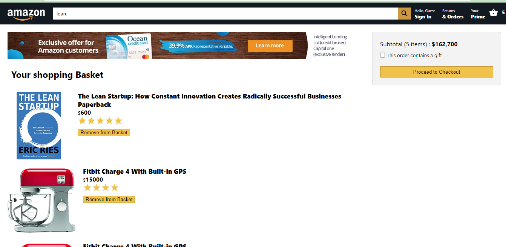

# 👨‍💻 Amazon Clone

### _Amazon Clone built using ReactJs and Firebase hope you like it. Tweak it and use it !!_

### Link :link: https://gaurav-amazon-clone.netlify.app//

## Images

## Run Locally

- Run this command `git clone https://github.com/Gaurav1745/Amazon-clone-.git`
- You are now in the dev environment and you can play around

## Tech Stack

- React.js
- CSS3
- Node js
- Firebase
